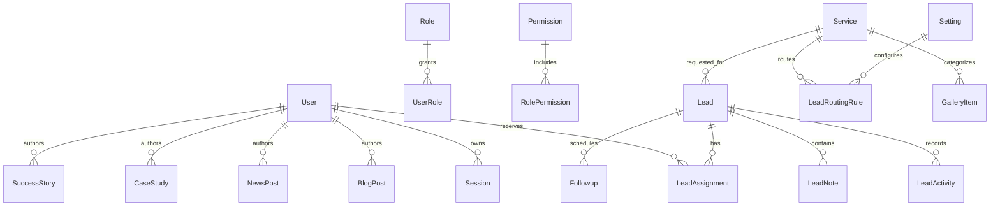

# Database ER Diagram

The Prisma schema in `prisma/schema.prisma` is the implementation source of truth. Query paths should index lead status, service, city, assignment owner, publish status, slug, and scheduled follow-up date.
