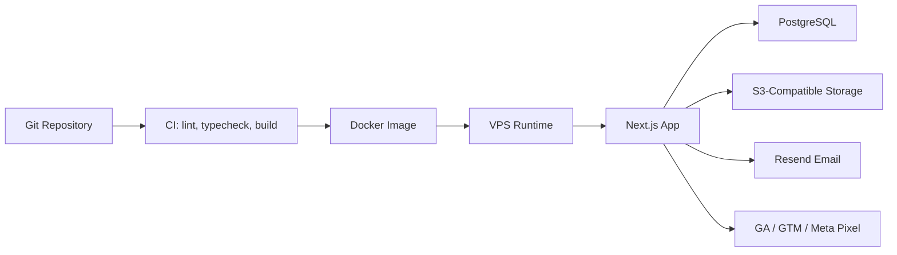

# Deployment Architecture

The app is prepared for container deployment with environment-based provider configuration. Production should run behind a TLS reverse proxy, use managed or backed-up PostgreSQL, and store uploads outside the application filesystem.
