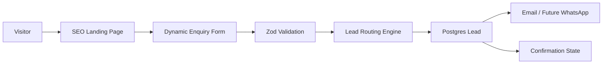
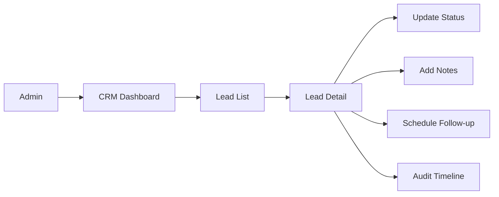
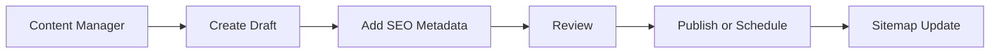

# User Flow Diagrams

## Public Lead Capture

```mermaid
flowchart LR
  Visitor["Visitor"] --> Website["SEO Landing Page"]
  Website --> Form["Dynamic Enquiry Form"]
  Form --> Validate["Zod Validation"]
  Validate --> Route["Lead Routing Engine"]
  Route --> Store["Postgres Lead"]
  Store --> Notify["Email / Future WhatsApp"]
  Store --> ThankYou["Confirmation State"]
```

## CRM Lead Operations

```mermaid
flowchart LR
  Admin["Admin"] --> Dashboard["CRM Dashboard"]
  Dashboard --> LeadList["Lead List"]
  LeadList --> Detail["Lead Detail"]
  Detail --> Status["Update Status"]
  Detail --> Notes["Add Notes"]
  Detail --> Followup["Schedule Follow-up"]
  Detail --> Audit["Audit Timeline"]
```

## CMS Publishing

```mermaid
flowchart LR
  ContentManager["Content Manager"] --> Draft["Create Draft"]
  Draft --> Seo["Add SEO Metadata"]
  Seo --> Review["Review"]
  Review --> Publish["Publish or Schedule"]
  Publish --> Sitemap["Sitemap Update"]
```
